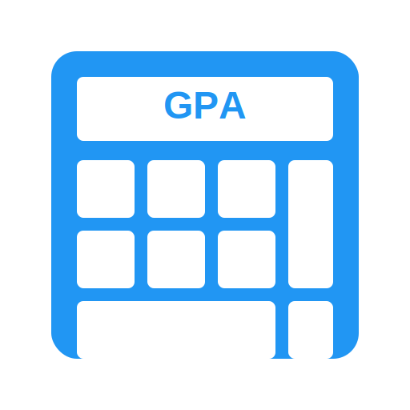

# GPA Calc

[](https://choosealicense.com/licenses/mit/)
[](https://omar7001-b.github.io/gpa-calc/)
[](https://github.com/Omar7001-B/gpa-calc/issues)
[](https://github.com/Omar7001-B/gpa-calc/stargazers)

<div align="center">
  
  <h3>A Modern GPA Calculator & Academic Planning Tool</h3>
  <p>Calculate your current GPA and plan your academic goals with this intuitive web application.</p>
</div>

[View Demo](https://omar7001-b.github.io/gpa-calc/) • [Report Bug](https://github.com/Omar7001-B/gpa-calc/issues) • [Request Feature](https://github.com/Omar7001-B/gpa-calc/issues)

## 📋 Table of Contents
- [Overview](#overview)
- [Features](#features)
- [Calculators](#calculators)
- [Tech Stack](#tech-stack)
- [Getting Started](#getting-started)
- [Usage Guide](#usage-guide)
- [Browser Support](#browser-support)
- [Contributing](#contributing)
- [License](#license)
- [Contact](#contact)

## 🎯 Overview

GPA Calc is a comprehensive web application designed to help students track and plan their academic performance. With its intuitive interface and real-time calculations, students can easily:
- Calculate their current GPA
- Plan future academic goals
- Track credit hours
- Predict future GPA
- Determine required performance for target GPAs

## ✨ Features

### User Experience
- 🎨 Clean, modern interface
- 📱 Fully responsive design
- ⚡ Real-time validation
- 📑 Reference grading scale
- 🖱️ Intuitive navigation
- 💾 Browser history support
- 🔄 Dynamic calculations

## 🧮 Calculators

### 1. GPA Calculator
- Calculate current GPA from courses
- Dynamic course management
- Support for standard letter grades (A to F)
- Automatic calculations based on credit hours
- Real-time GPA computation

### 2. Target GPA Calculator
- Set target cumulative GPA
- Input current credits and GPA
- Calculate required GPA for future courses
- Plan academic goals effectively
- Instant feedback on targets

### 3. Next GPA Calculator
- Predict future cumulative GPA
- Input estimated performance
- Calculate expected GPA after upcoming courses
- Track academic progress
- Plan course strategies

## 🛠️ Tech Stack

- 
- 
- 
- 

## 🚀 Getting Started

1. Clone the repository:
```bash
git clone https://github.com/Omar7001-B/gpa-calc.git
cd gpa-calc
```

2. Open `index.html` in your preferred browser

No build process or dependencies required - it just works!

## 📖 Usage Guide

### Current GPA Calculation
1. Navigate to "GPA Calculator"
2. Input your courses:
   ```
   Course Name (optional)
   Credit Hours
   Grade Received
   ```
3. Add more courses as needed
4. View your calculated GPA instantly

### Target GPA Planning
1. Go to "Target GPA Calculator"
2. Enter your academic data:
   ```
   Current GPA
   Total Credits
   Target GPA
   Planned Credits
   ```
3. Get instant feedback on required performance

### Next GPA Prediction
1. Access "Next GPA Calculator"
2. Enter your information:
   ```
   Current GPA
   Current Credits
   Estimated Next GPA
   Additional Credits
   ```
3. View your predicted cumulative GPA

## 🌐 Browser Support

- Google Chrome (Recommended)
- Mozilla Firefox
- Safari
- Microsoft Edge
- Any modern browser with ES6 support

## 🤝 Contributing

Contributions make the open-source community thrive. Any contributions you make are **greatly appreciated**.

1. Fork the Project
2. Create your Feature Branch (`git checkout -b feature/AmazingFeature`)
3. Commit your Changes (`git commit -m 'Add some AmazingFeature'`)
4. Push to the Branch (`git push origin feature/AmazingFeature`)
5. Open a Pull Request

## 📄 License

Distributed under the MIT License. See `LICENSE` for more information.

## 📧 Contact

Omar Abbas - [@GitHub](https://github.com/Omar7001-B)

Project Link: [https://github.com/Omar7001-B/gpa-calc](https://github.com/Omar7001-B/gpa-calc)

---
<div align="center">
  Made with ❤️ by Omar Abbas
</div>

